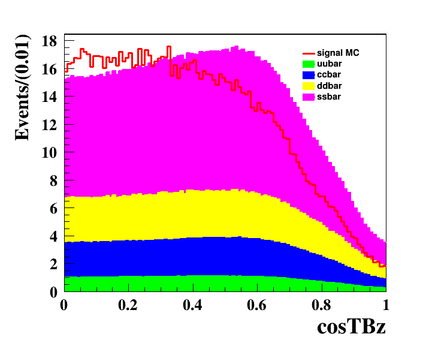

# Study of decay $B^0(\bar{B^{0}})\to K^+K^-\pi^0$

😀😄😄

basf2 version: `release-06-01-12`

## TO DO

- [ ] use git to manager my analysis files
- [ ] Amplitude analysis

## Update

### 2023.8.16

- changed the kaonID selections
- removed the selections of gamma angle, changed it to cosin of helicity angle of gammas
- clean up the root macro of make sample (`sample.C`)
- retrained the cs FBDT weight files

## Selection criteria

### Preliminary selections

[The distribution of different variables](./notes/preliminary_selections.md)

- kaon selection
	- kaonID>0.2
- $\pi^0$ selection
	- gamma
		- clusterNHits > 1.5 and 0.2967 < clusterTheta < 2.6180
		- gamma in different range:
			- clusterReg=1: E>0.1 GeV
			- clusterReg=2: E>0.06 GeV
			- clusterReg=3: E>0.1 GeV
		- cluster shape: cluseterE9E21>0.9
	- $\pi^0$
		- the mass window used now: $0.111 \lt M_{\pi_{0}} \lt 0.153 \rm~GeV/c^2$, invariant mass between m_mean +- 3sigma.
        - $|\cos\theta_{helicity}|<0.95$

### Best $B^0$ candidate selection

We used two variables to select the best $B^0$ candidate: 

- $\pi^0$ mass constrained chi2 
- chiProb of $B^0$ vertex fit chi2

## continuum suppression

MC sample: MC 15 run-indepent qqbar

## Flavor Tag

used the signal MC to do flavor tag, the result is good.

generic MC sample: MC15ri_mixed_1abinv

### to do
- [ ] run generic MC with flavor tag, check the qrMC
	- store the topology information when run the generic MC

## Study of background from generic BBbar

$$
M_{Inv} = \sqrt{E^2 - p^2}
$$

The energy of kaon from the variable manager is from what? Should I assume the mass of candidate to be the mass of kaon and then calculate the energy of kaon?

### to do
- [ ] check the distribution of invariant mass of the two Kaon system, and with hypothesis that one of the kaon is a pion

